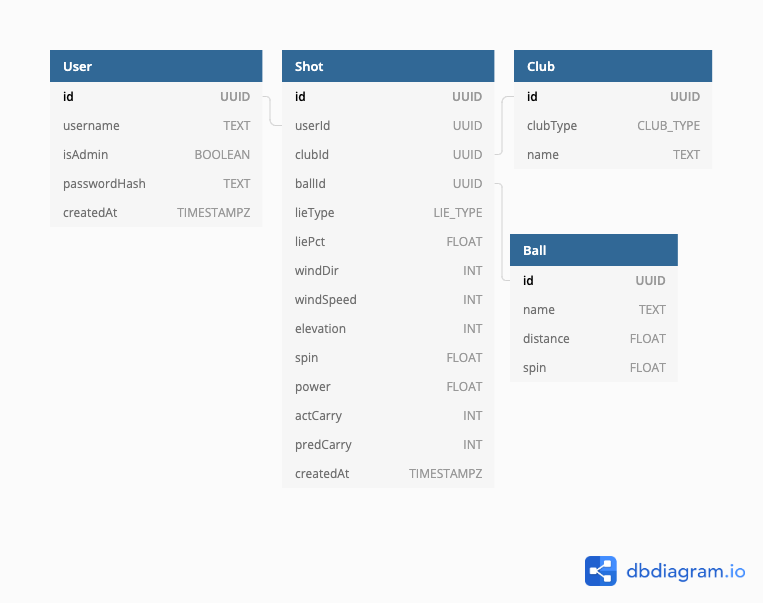

# Database

Vyardage uses Postgres to persist data. The database is provided by Heroku in production/staging and through Docker in development/testing.

#### Naming Conventions

Altough somewhat unusual, tables use singular PascalCase names and columns camelCase names. This is because camelCase is used in code, and I cannot think of a good reason to use the conventional snake-case in database, even if the conversion is automatic...

## Migration

Database migration is handled by `knex` and defined in the migration files located in `server/migrations`. The root `package.json` includes the shortcut script `dev:migrate` to apply the latest schema locally without unnecessary pain.

If you need to use other migration commands, spin up the database container first and then enter the app container with bash:

```bash
docker-compose up -d db
docker-compose run app bash
```

Don't forget to clean up the database container with `docker-compose down` once you are done.

## Database Diagram



The source for the diagram is available [here](./assets/database.dbml).
